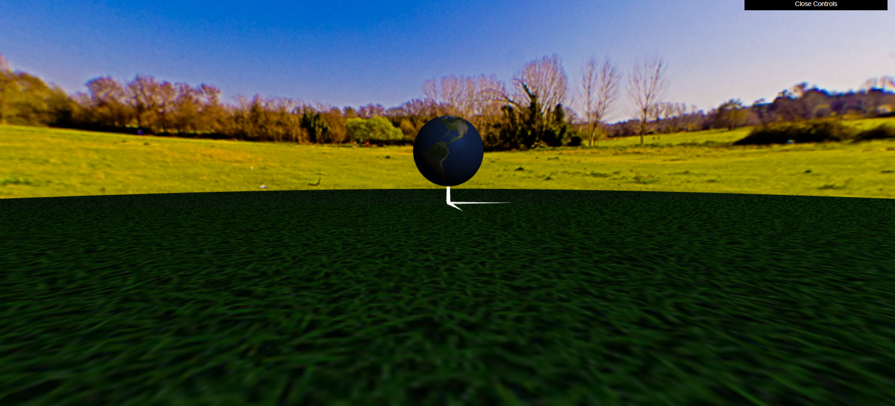
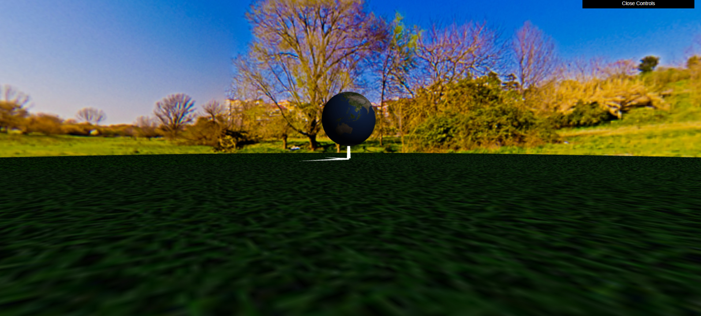
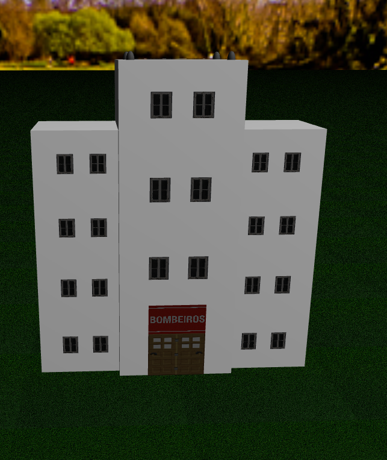
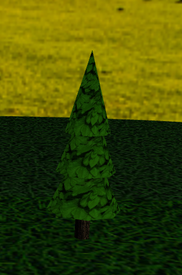
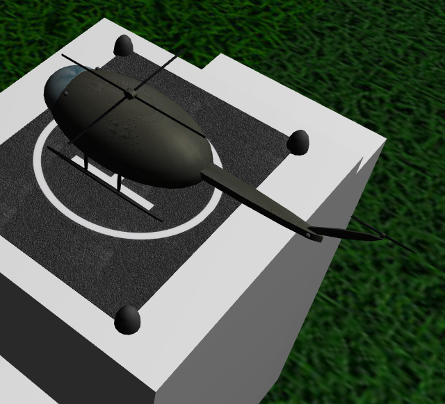
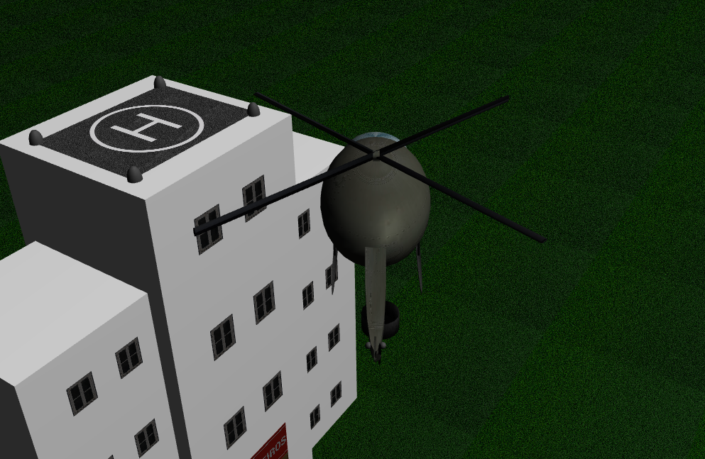
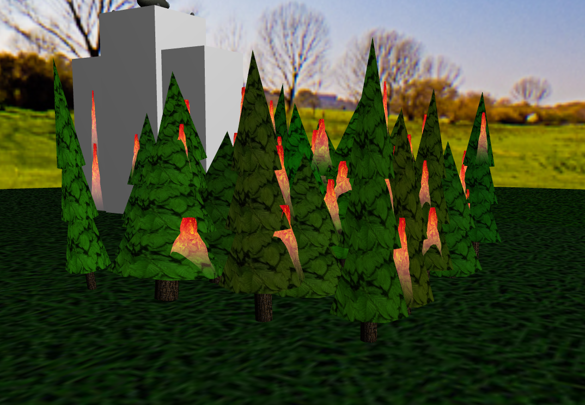
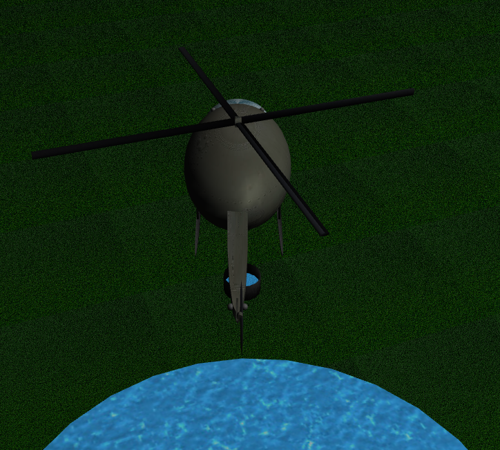
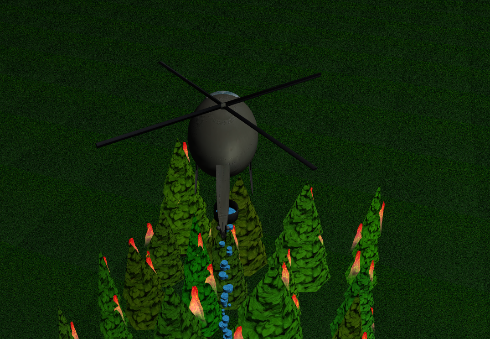
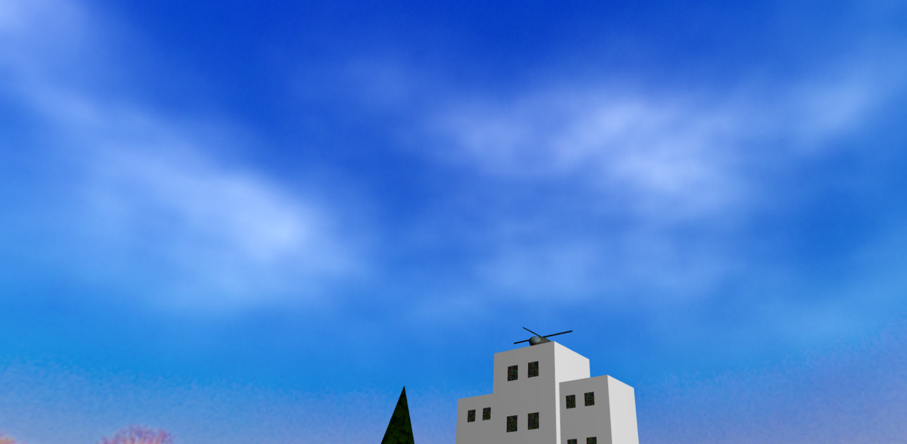

# CG 2024/2025

## Group T05G09

- Lucas Greco Do Espírito Santo Jorge - 202208296
- Sara da Silva Azevedo - 202006902

### Project 

In the first part of exercise 1.1, we created a shpere with earth texture.

In the exercise 1.2, we created a panorama with a skybox and a plane with a texture.

In exercise 2, we create the firefighters building. 

Then, in the next exercise added the tree textures and create the florest. 

In exercise 4, we created the helicopter.

Next, in exercise 5, we completed the movements of the helicopter. 

In exercise 6, we simulated a forest fire and added a lake to extinguish the flames afterward.

To end, we added the flame ripple.

For the adicional requirement, we added clouds to the skybox.
