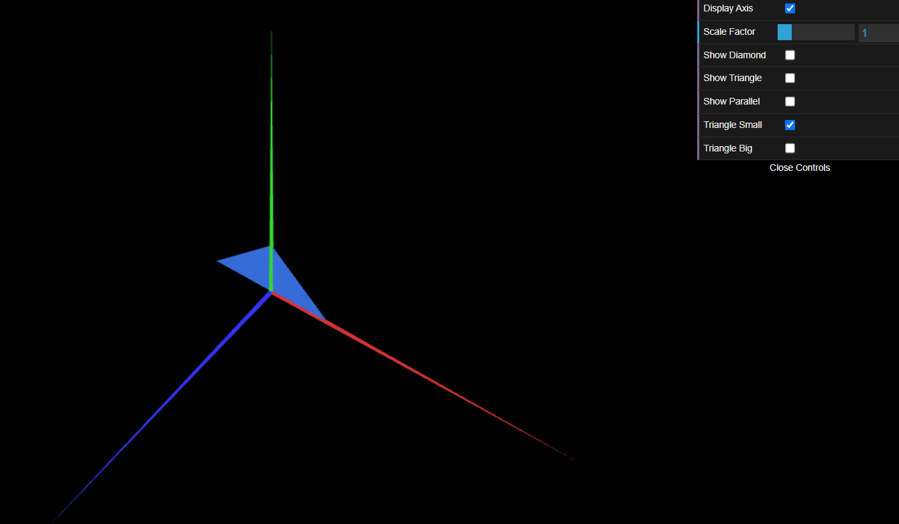
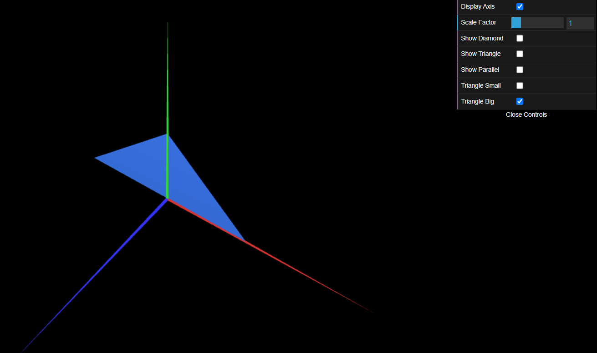

# CG 2024/2025

## Group T05G09

## TP 1 Notes

### Exercise 1:
Using MyDiamond as example, we created a new class called MyTriangle, with the same structure as MyDiamond, but with the vertices of a triangle.

After that, we created two new checkboxes, ShowTriangle and ShowDiamond, to show the triangle and the diamond, respectively.

We also created a new class MyParallelogram, and a new checkbox ShowParallelogram.

### Exercise 2:

Image 1: MyTriangleSmall

Image 2: MyTriangleBig