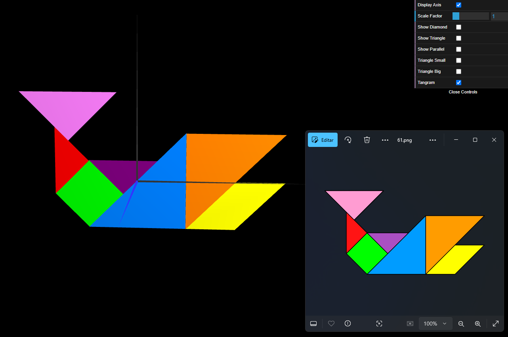
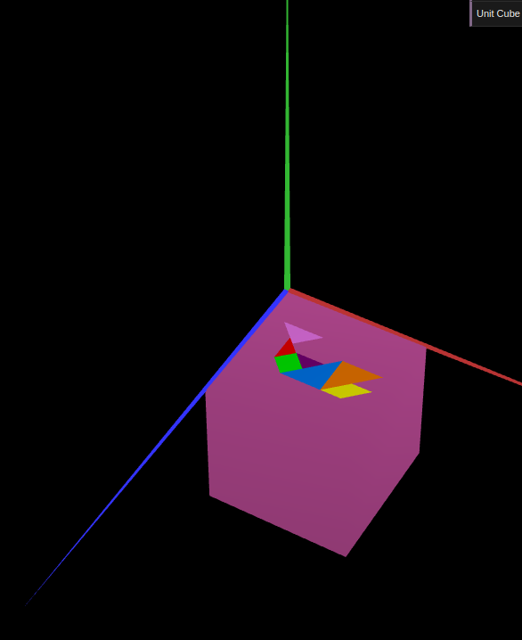
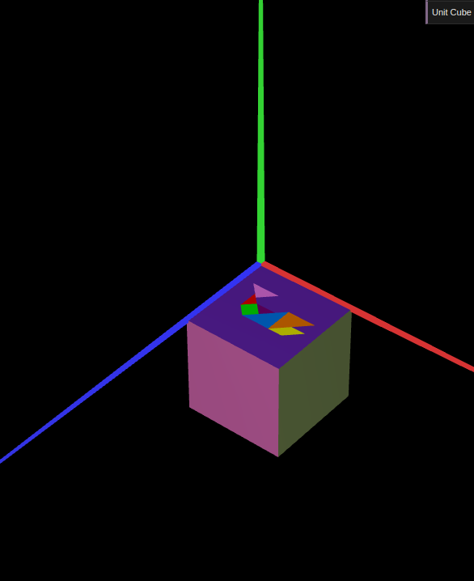

# CG 2024/2025

## Group T05G09

## TP 2 Notes

### Exercise 1:

In exercise 1, using the figures from TP1, we create a MyTangram.js by applying graphic transformations. 

The most complicated part was arranging the pieces as the transformation values are not always integers.

Additionally, we added a new checkbox to control the tangram's visibility.

Image 1: Tangram

### Exercise 2:

In exercise 2, we constructed a unit cube, defined its vertices and faces, and combined it with the Tangram from exercise 1, and then rotated both figures and aligned them to be parallel to the XY plane.

Image 2: MyUnitCube

### Exercise 3:

In exercise 3, we created a new unit cube using planes drawn several times to define the faces.

Image 3: MyUnitCubeQuad
