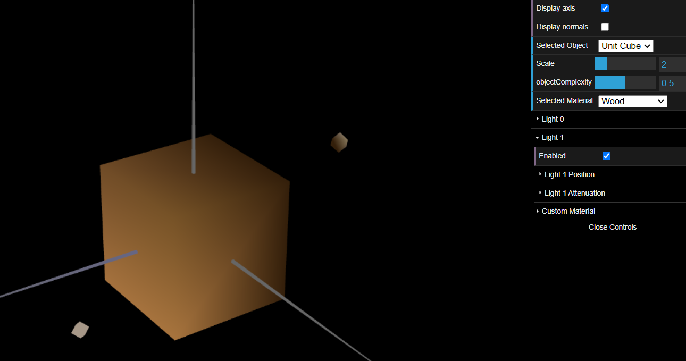
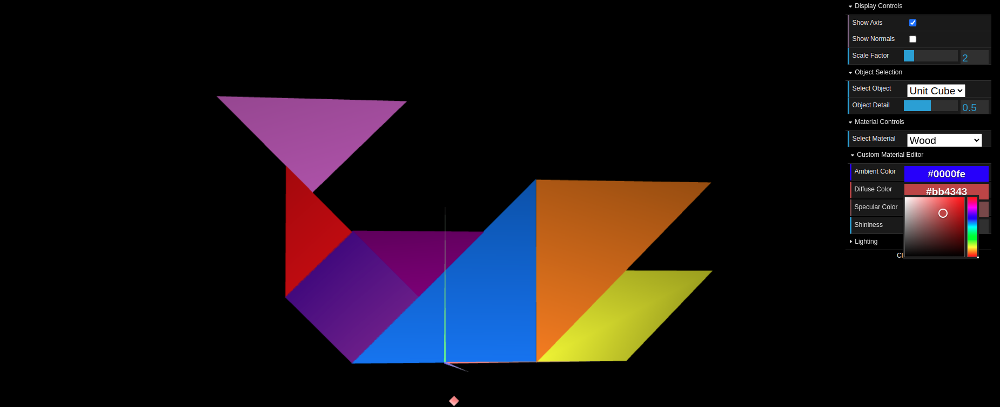
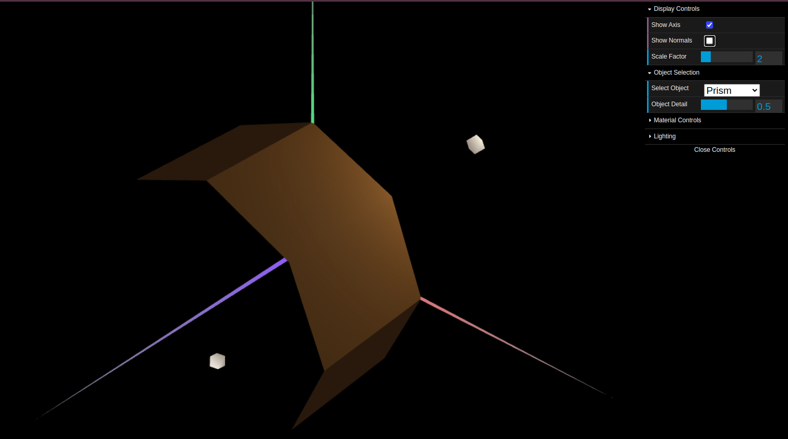
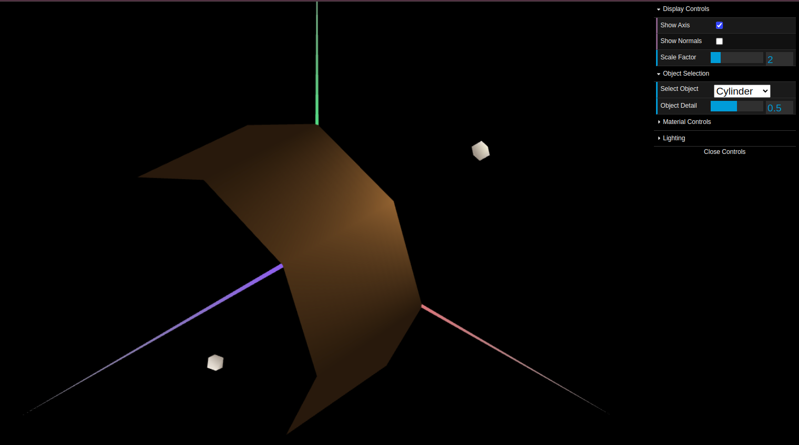

# CG 2024/2025

## Group T05G09

## TP 3 Notes

### Exercise 1:

In exercise 1, we created a material with a similar color to wood with a low specular component.

Image 1: Cube with wood color

We also enhanced the tangram by applying the corresponding colours.

- Diamond: Custom material (controllable through interface - was green) 
- Triangle: Pink material
- Parallelogram: Yellow material
- Small Triangle 1: Purple material
- Big Triangle 1: Blue material
- Big Triangle 2: Orange material
- Small Triangle 2: Red material

Image 2: Colored tangram

### Exercise 2:

In Exercise 2, we implemented the MyPrism class. Using the pyramid code as a foundation, we extended it to create a more complex 3D object.
For the prism, each face has a unique constant normal vector perpendicular to that face. This implementation creates a "flat shading" effect where normals change abruptly at edges. 

Image 3: Prism 

### Exercise 3:

In Exercise 3, we created the MyCylinder class by extending our prism implementation. We changed how normal vectors are calculated. The normals are calculated per vertex, pointing outwards, which creates interpolated shading.
Smooth shading decreases the visual impact of the light, improving the spherical appearance.

Image 4: Cylinder 
