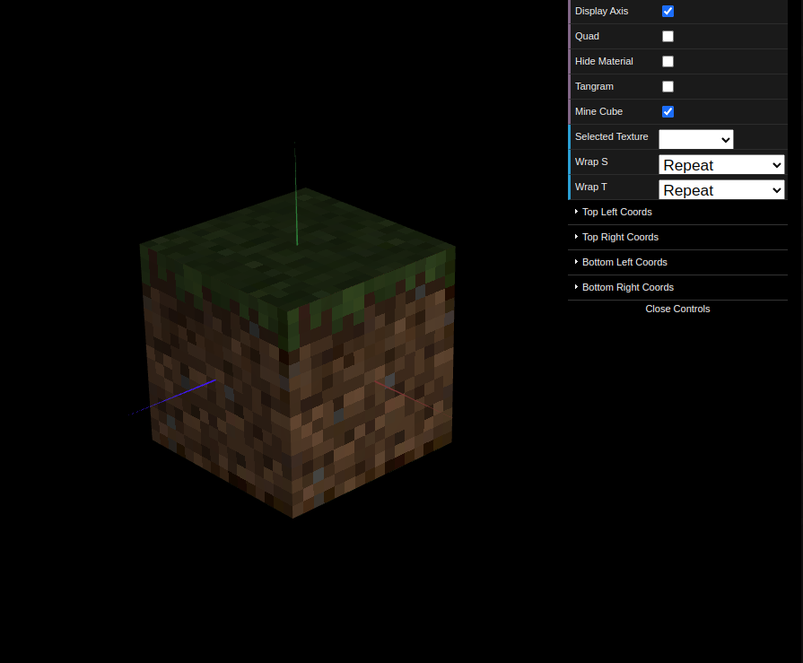

# CG 2024/2025

## Group T05G09

### TP 4 Notes

#### Exercise 1: Tangram Textures

In this exercise, we applied textures to each tangram piece. We also implemented a function to dynamically adjust the `texCoords` of specific objects based on user input, enabling the selection of corresponding colors.

To improve user interaction, we added a button to toggle the visibility of the quad, enhancing the visualization experience.


#### Exercise 2: Minecraft Grass Block Textures

For this exercise, we textured each side of a Minecraft grass block by modifying the constructor of `MyUnitCubeQuad` to accept texture loading. This allowed us to assign specific textures to each face of the block.  Initially, the block's faces appeared pixelated due to WebGL using linear filtering by default.


To resolve this issue, we applied the following command after activating the texture and before rendering the face, setting the filter to nearest (nearest filtering):

```js
this.gl.texParameteri(this.gl.TEXTURE_2D, this.gl.TEXTURE_MAG_FILTER, this.gl.NEAREST);
```

This adjustment ensured that the textures were displayed with proper pixelation, preserving the intended visual quality.


