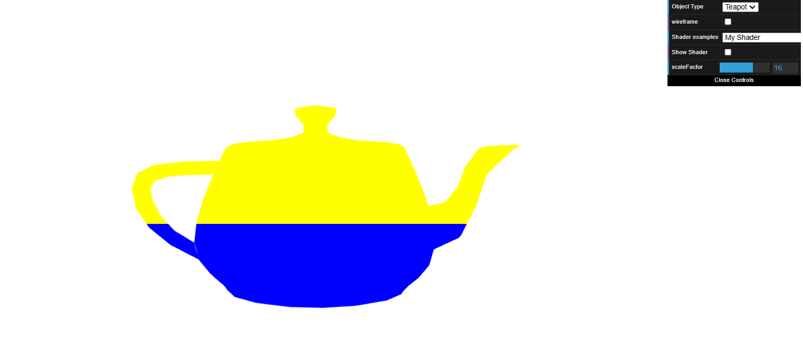
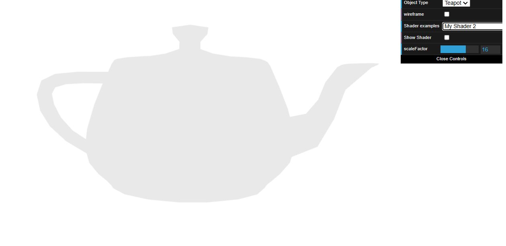
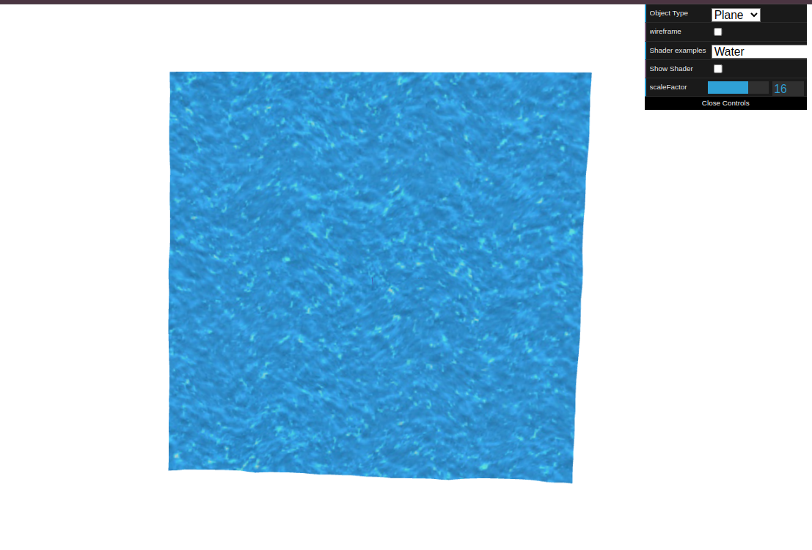

# CG 2024/2025

## Group T05G09

### TP 5 Notes

In the first part of exercise 1, we created new vertex and fragment shaders to render the teapot with one half painted blue and the other half yellow.

In the second part of exercise 1, we created a new fragment shaders to render the teapot with grayscale. 

In Exercise 3, we used shaders to apply a water texture to the plane. 

